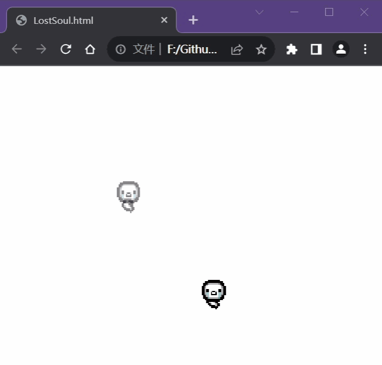
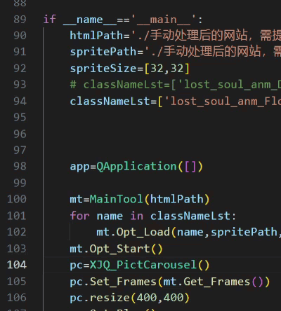

在逛网站时相中了一个动图，想保存但发现原来是CSS的keyframes特效，于是就有了本项目。

一开始花了点时间了解了keyframes这玩意儿，发现挺麻烦的想用js来完成的，但简单试了下html2canvas后发现这个不太行，
于是就打消了使用库的想法，而且对js也不是很熟，就转移到Python进行处理了。

 

# CSSKeyframesToGIF

本项目并不具备很强的泛用性，单纯是为了解析某个精灵动图并对其进行保存。
不使用录屏的原因是后期工作量有亿点大(需要对每一张图片进行背景透明化)，
并且对于一些半透明的精灵图来说该方法的效果并不理想。

本项目依赖[XJ_Python](https://github.com/Ls-Jan/XJ_Python)，搭配另一个项目[GIFCreator](https://github.com/Ls-Jan/PyQt_GIFCreator)可将生成的图片序列转为动图。

 
 

### 网页中的keyframes特效动图(精灵图)
[LostSoul.html](./手动处理后的网站，需提取其中的目标动画/LostSoul.html)

 

### 处理结果

 

### 导出图片序列后合成为GIF动图

由于GIF的局限性，半透明的图片合成为GIF后会失去其透明性，因此上面的漂浮游魂并没有原图中的“逐渐消失”效果。

